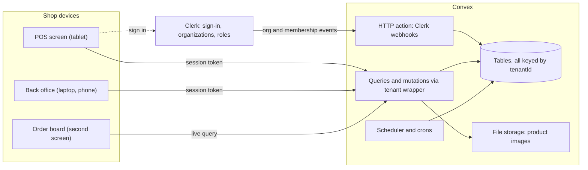
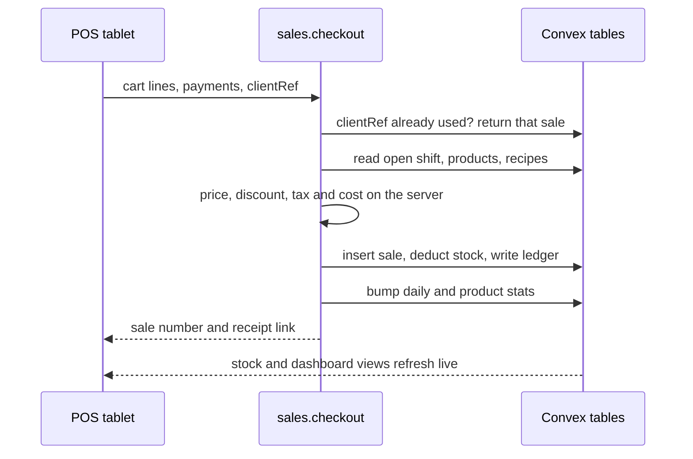

# Multi-tenant POS — MVP plan

Stack: Next.js (App Router), Clerk (Organizations), Convex. Target: coffee shops, groceries, bakeries and small retail.

## Goals and scope

Most starter POS tools tell an owner how much they sold. Very few tell them how much they *made*, because that requires knowing what each item costs, down to the grams of coffee and millilitres of milk in a latte. This MVP treats costing as a first-class feature and builds selling, inventory and analytics around it.

### The MVP is done when

- A new shop goes from sign-up to its first sale in under 15 minutes using a business template.
- A cashier checks out a 3-item order with one modifier in under 10 seconds.
- Every sale deducts the correct ingredients or items from stock and records its cost at the moment of sale.
- The owner's dashboard shows revenue, gross profit and top items, updating live as sales happen.
- An owner can export any part of the business to CSV, and the files open correctly in Excel and Google Sheets with totals that match the dashboard.
- Automated tests prove that one shop can never read or change another shop's data.
- Three to five pilot shops (at least one café and one grocery) use it for a full week of real trading.

### What's in, and what waits

| Area            | In the MVP                                                                                                       | Later                                                                          |
|-----------------|------------------------------------------------------------------------------------------------------------------|--------------------------------------------------------------------------------|
| **Tenancy**     | Sign-up, one business per Clerk organization, staff invites, three roles, business templates                     | Multiple branches per business, franchise roll-ups                             |
| **Products**    | Categories, modifiers (size, milk, add-ons), images, barcodes, CSV import, archive                               | Combos and bundles, scheduled prices, happy hour                               |
| **Inventory**   | Stock items, receiving, adjustments, waste, stock counts, low-stock alerts, stock ledger                         | Purchase orders, batch and expiry tracking, branch transfers                   |
| **Costing**     | Weighted average cost, recipe costing, margin per item, margin alerts, cost snapshot on each sale                | FIFO costing, landed costs, price-change simulator                             |
| **Selling**     | Touch-first checkout, discounts, split payments, change, printed and digital receipts, shifts, voids and refunds | Full offline mode, customer-facing display, loyalty, card terminal integration |
| **Analytics**   | Sales, gross profit, top items by profit, hourly heatmap, payment mix, stock and margin alerts                   | AI assistant, customer analytics                                               |
| **Data export** | CSV export of every dataset with date ranges, full ZIP backup, spreadsheet round-trip for products, export log   | Scheduled exports by email, direct sync to accounting tools                    |

Design the schema for multiple locations now (it's cheap), but ship a single-location UI. Adding a `locationId` later to every stock and sales record is a painful migration.

## Architecture and tenancy

This stack fits a POS unusually well. Convex queries are live subscriptions, so a sale rung up on the counter tablet updates the stock screen and the owner's dashboard on their phone with no polling code. Convex mutations run as transactions, so a checkout either writes the sale, the stock deductions and the stats together, or writes nothing. Clerk Organizations give you business sign-up, staff invitations, an organization switcher and roles without building them.



#### Key decision: one shared database, every row carries a tenantId

All businesses share the same Convex tables, and every tenant-owned document has a `tenantId` field that leads every index. This is the simplest and cheapest model to run and is standard for SaaS at this stage. The trade-off is that isolation is enforced in your code, so the code must make it impossible to forget: every tenant-scoped function goes through one wrapper that checks membership.

### How a request finds its tenant

1.  A user signs in with Clerk, then creates a business (a Clerk Organization) during onboarding or accepts an invite to one.
2.  Clerk sends `organization.*` and `organizationMembership.*` webhooks to a Convex HTTP action, which verifies the signature (Svix) and upserts rows in `tenants` and `members`.
3.  The shop's slug lives in the URL (`/brewlab/pos`). Clerk's middleware option `organizationSyncOptions` keeps the active organization matched to the URL, so switching shops is just navigation.
4.  The client passes `tenantId` to every Convex call. The tenant wrapper looks up an active `members` row for that tenant and the caller's Clerk user ID (`identity.subject`), and refuses the call if there isn't one.
5.  Handlers only query through indexes that start with `tenantId`, and any document ID the client sends is re-checked to belong to the same tenant before it's read or changed.

Checking membership in your own table, rather than trusting an organization claim in the token, means access is revoked the moment a manager disables a staff member, and it still works if someone opens a stale tab for a different shop.

**convex/lib/tenant.ts**

```ts
import { ConvexError, v } from "convex/values";
import { customMutation, customQuery } from "convex-helpers/server/customFunctions";
import { mutation, query, type QueryCtx } from "../_generated/server";
import type { Doc, Id } from "../_generated/dataModel";

type Role = Doc<"members">["role"];

async function loadMembership(ctx: QueryCtx, tenantId: Id<"tenants">) {
  const identity = await ctx.auth.getUserIdentity();
  if (!identity) throw new ConvexError("Sign in to continue.");

  const member = await ctx.db
    .query("members")
    .withIndex("by_tenant_user", (q) =>
      q.eq("tenantId", tenantId).eq("clerkUserId", identity.subject))
    .unique();
  if (!member || member.status !== "active") {
    throw new ConvexError("You don't have access to this business.");
  }

  const tenant = await ctx.db.get(tenantId);
  if (!tenant) throw new ConvexError("Business not found.");
  return { tenant, member };
}

const tenantArgs = { tenantId: v.id("tenants") };

export const tenantQuery = customQuery(query, {
  args: tenantArgs,
  input: async (ctx, { tenantId }) => ({
    ctx: { tenantId, ...(await loadMembership(ctx, tenantId)) },
    args: {},
  }),
});

export const tenantMutation = customMutation(mutation, {
  args: tenantArgs,
  input: async (ctx, { tenantId }) => ({
    ctx: { tenantId, ...(await loadMembership(ctx, tenantId)) },
    args: {},
  }),
});

export function requireRole(member: Doc<"members">, ...allowed: Role[]) {
  if (!allowed.includes(member.role)) {
    throw new ConvexError("Your role can't do this. Ask the owner or a manager.");
  }
}

// Every ID that arrives from the client is re-checked against the tenant.
type Scoped = "categories" | "products" | "modifierGroups" | "stockItems" | "sales" | "shifts";
export async function getOwned<T extends Scoped>(
  ctx: QueryCtx, tenantId: Id<"tenants">, id: Id<T>,
) {
  const doc = (await ctx.db.get(id)) as Doc<Scoped> | null;
  if (!doc || doc.tenantId !== tenantId) throw new ConvexError("Not found.");
  return doc as Doc<T>;
}
```

**convex/products.ts (how every tenant function looks)**

```ts
export const list = tenantQuery({
  args: {},
  handler: (ctx) =>
    ctx.db
      .query("products")
      .withIndex("by_tenant_active", (q) =>
        q.eq("tenantId", ctx.tenantId).eq("isActive", true))
      .collect(),
});

export const updatePrice = tenantMutation({
  args: { productId: v.id("products"), price: v.number() },
  handler: async (ctx, { productId, price }) => {
    requireRole(ctx.member, "owner", "manager");
    await getOwned(ctx, ctx.tenantId, productId);
    await ctx.db.patch(productId, { price });
  },
});
```

Make it a team rule (and a lint check if you like) that files in `convex/` never import the plain `query` or `mutation` for tenant data. Only the webhook handler and truly public endpoints, such as the digital receipt page, use them.

## Data model

#### Key decision: separate what you sell from what you stock

**Products** are what appear on the POS screen. **Stock items** are what sits on your shelves. A café's iced latte is a *recipe* product that consumes beans, milk and a cup. A grocery's can of soda is a *stocked* product linked one-to-one to a stock item, which the app creates automatically so grocers never see the difference. A bakery uses both. A service (gift wrapping, printing) has no stock at all. This one model serves every business type you're targeting.

### Conventions that prevent the classic POS bugs

- **Money is an integer in minor units.** ₱140.00 is stored as `14000`. Floating-point money causes one-centavo errors that never reconcile. Keep all money maths in one `lib/money.ts` helper.
- **Quantities use base units** (grams, millilitres, pieces), with an optional purchase unit for receiving (1 bag = 1,000 g).
- **Sales store snapshots.** Each sale line keeps the product name, price and unit cost as they were at checkout, so history and profit never change when you edit the menu.
- **Reports use a business date** computed in the shop's timezone, so a sale at 11:50 pm lands on the right day.
- **The stock ledger is the source of truth.** `onHand` is a cached total that can always be rebuilt from movements.

**convex/schema.ts**

```ts
import { defineSchema, defineTable } from "convex/server";
import { v } from "convex/values";

const tenantId = v.id("tenants");
const money = v.number(); // integer minor units: ₱140.00 → 14000
const role = v.union(v.literal("owner"), v.literal("manager"), v.literal("cashier"));
const payMethod = v.union(v.literal("cash"), v.literal("ewallet"), v.literal("card"));

export default defineSchema({
  tenants: defineTable({
    clerkOrgId: v.string(),
    name: v.string(),
    slug: v.string(),
    businessType: v.union(v.literal("cafe"), v.literal("grocery"),
      v.literal("bakery"), v.literal("retail")),
    currency: v.string(),            // "PHP"
    timezone: v.string(),            // "Asia/Manila"
    taxRateBps: v.number(),          // 1200 = 12%
    pricesIncludeTax: v.boolean(),
    targetMarginBps: v.number(),     // 6000 = 60%, drives margin alerts
    discountLimitBps: v.number(),    // max cashier discount without a manager PIN
    receiptFooter: v.optional(v.string()),
  })
    .index("by_clerk_org", ["clerkOrgId"])
    .index("by_slug", ["slug"]),

  members: defineTable({
    tenantId,
    clerkUserId: v.string(),
    name: v.string(),
    role,
    status: v.union(v.literal("active"), v.literal("disabled")),
    pinHash: v.optional(v.string()), // manager overrides at the counter
  })
    .index("by_tenant_user", ["tenantId", "clerkUserId"])
    .index("by_user", ["clerkUserId"]),

  categories: defineTable({ tenantId, name: v.string(), sortOrder: v.number() })
    .index("by_tenant", ["tenantId", "sortOrder"]),

  products: defineTable({
    tenantId,
    categoryId: v.optional(v.id("categories")),
    name: v.string(),
    kind: v.union(v.literal("stocked"), v.literal("recipe"), v.literal("service")),
    stockItemId: v.optional(v.id("stockItems")), // when kind is "stocked"
    price: money,
    unitCost: money,                 // cached, recomputed when costs change
    barcode: v.optional(v.string()),
    sku: v.optional(v.string()),
    imageId: v.optional(v.id("_storage")),
    modifierGroupIds: v.array(v.id("modifierGroups")),
    isActive: v.boolean(),           // archive instead of delete
  })
    .index("by_tenant_active", ["tenantId", "isActive"])
    .index("by_tenant_barcode", ["tenantId", "barcode"])
    .index("by_stock_item", ["stockItemId"])
    .searchIndex("search_name", { searchField: "name", filterFields: ["tenantId", "isActive"] }),

  modifierGroups: defineTable({
    tenantId,
    name: v.string(),                // "Size", "Milk", "Add-ons"
    minSelect: v.number(),
    maxSelect: v.number(),
    options: v.array(v.object({
      key: v.string(),
      name: v.string(),              // "Oat milk"
      priceDelta: money,             // +2000
      recipeDelta: v.array(v.object({ stockItemId: v.id("stockItems"), qty: v.number() })),
    })),
  }).index("by_tenant", ["tenantId"]),

  stockItems: defineTable({
    tenantId,
    name: v.string(),
    baseUnit: v.union(v.literal("pc"), v.literal("g"), v.literal("ml")),
    purchaseUnit: v.optional(v.object({ name: v.string(), factor: v.number() })),
    onHand: v.number(),              // base units, cache of the ledger
    avgCost: v.number(),             // minor units per base unit (can be fractional)
    reorderPoint: v.number(),
    supplierId: v.optional(v.id("suppliers")),
  }).index("by_tenant", ["tenantId"]),

  recipeLines: defineTable({
    tenantId,
    productId: v.id("products"),
    stockItemId: v.id("stockItems"),
    qty: v.number(),                 // base units per 1 product sold
  })
    .index("by_product", ["productId"])
    .index("by_stock_item", ["stockItemId"]),

  stockMovements: defineTable({
    tenantId,
    stockItemId: v.id("stockItems"),
    type: v.union(v.literal("receive"), v.literal("sale"), v.literal("refund"),
      v.literal("adjust"), v.literal("waste")),
    qty: v.number(),                 // positive in, negative out
    unitCost: v.number(),
    saleId: v.optional(v.id("sales")),
    memberId: v.id("members"),
    note: v.optional(v.string()),
  }).index("by_tenant_item", ["tenantId", "stockItemId"]),

  suppliers: defineTable({ tenantId, name: v.string(), phone: v.optional(v.string()) })
    .index("by_tenant", ["tenantId"]),

  shifts: defineTable({
    tenantId,
    memberId: v.id("members"),
    status: v.union(v.literal("open"), v.literal("closed")),
    openingCash: money,
    expectedCash: v.optional(money),
    countedCash: v.optional(money),
    closedAt: v.optional(v.number()),
  }).index("by_tenant_status", ["tenantId", "status"]),

  sales: defineTable({
    tenantId,
    number: v.number(),              // sequential per tenant, never reset
    clientRef: v.string(),           // idempotency key generated on the device
    shiftId: v.id("shifts"),
    memberId: v.id("members"),
    businessDate: v.string(),        // "2026-09-11" in the shop's timezone
    lines: v.array(v.object({
      productId: v.id("products"),
      name: v.string(),
      optionNames: v.array(v.string()),
      qty: v.number(),
      unitPrice: money,
      unitCost: money,               // snapshot at checkout
      discount: money,
    })),
    subtotal: money, discount: money, tax: money, total: money, cogs: money,
    payments: v.array(v.object({ method: payMethod, amount: money, ref: v.optional(v.string()) })),
    changeGiven: money,
    status: v.union(v.literal("completed"), v.literal("voided"), v.literal("refunded")),
    receiptToken: v.string(),        // unguessable, for the public receipt link
  })
    .index("by_tenant_date", ["tenantId", "businessDate"])
    .index("by_tenant_clientRef", ["tenantId", "clientRef"])
    .index("by_receipt_token", ["receiptToken"]),

  dailyStats: defineTable({
    tenantId,
    businessDate: v.string(),
    revenue: money, cogs: money, orders: v.number(),
    cash: money, ewallet: money, card: money,
    byHour: v.array(v.number()),     // 24 revenue buckets
  }).index("by_tenant_date", ["tenantId", "businessDate"]),

  productDailyStats: defineTable({
    tenantId,
    businessDate: v.string(),
    productId: v.id("products"),
    qty: v.number(), revenue: money, cogs: money,
  }).index("by_tenant_date_product", ["tenantId", "businessDate", "productId"]),

  exports: defineTable({
    tenantId,
    requestedBy: v.id("members"),
    dataset: v.union(v.literal("products"), v.literal("stockItems"), v.literal("stockMovements"),
      v.literal("sales"), v.literal("saleLines"), v.literal("shifts"),
      v.literal("dailySummary"), v.literal("productPerformance"), v.literal("fullBackup")),
    from: v.optional(v.string()),    // business dates, for date-ranged datasets
    to: v.optional(v.string()),
    status: v.union(v.literal("working"), v.literal("ready"), v.literal("failed")),
    fileId: v.optional(v.id("_storage")),
    rowCount: v.optional(v.number()),
    error: v.optional(v.string()),
    expiresAt: v.optional(v.number()), // file deleted by a daily cron after 7 days
  })
    .index("by_tenant", ["tenantId"])
    .index("by_tenant_status", ["tenantId", "status"])
    .index("by_expires", ["expiresAt"]),

  counters: defineTable({ tenantId, name: v.string(), value: v.number() })
    .index("by_tenant_name", ["tenantId", "name"]),
});
```

## Core features

Each feature below lists what it does, the rules that matter most when you build it, and a concrete test for calling it done.

### Products and catalog

Owners and managers add products with a category, price, optional photo and barcode, then attach modifier groups: Size (small, medium, large), Milk (fresh, oat +₱20), Add-ons (extra shot +₱30), Sugar level. Grocery shops import products from a CSV and scan barcodes with a USB scanner or the device camera.

- A modifier can change both the price and the recipe, so a large drink adds 60 ml of milk to the stock deduction as well as ₱20 to the price.
- Products are archived, never deleted, because past sales reference them.
- Barcodes are unique within a shop (enforce in the mutation using the `by_tenant_barcode` index).
- Images upload straight to Convex file storage using a generated upload URL; resize on the client first so the POS grid stays fast on cheap tablets.
- The CSV importer previews rows, flags errors per row and imports in batches, so one bad row doesn't block 300 good ones.

**Done when** the café template creates 20 drinks with sizes in one step, and a grocery imports 300 items from CSV with clear per-row errors.

### Inventory

Stock items hold quantities in base units. Staff receive deliveries, log waste (spilled milk, expired bread) and correct counts. Every change writes a row to the stock ledger with who, what, why and when, so any on-hand figure can be explained.

- Receiving asks for quantity and *total* cost (what's on the supplier's receipt) and derives the unit cost. That matches how owners actually think.
- Never block a sale because stock says zero. Real shops run ahead of their data. Allow negative stock, flag it on the dashboard, and prompt a count.
- A stock count screen lists items with expected quantities; staff enter what they counted and the app writes adjustments for the differences in one pass.
- Low stock triggers when on-hand drops to the reorder point, and every item shows days of cover based on recent sales.

**Done when** the sum of the ledger equals on-hand for every item, and a full count of 50 items takes under 10 minutes.

### Costing

Use weighted average cost for the MVP. It's what small businesses understand, it needs no batch tracking, and it's accurate enough for pricing decisions. When stock is received, the average cost blends the old stock with the new:

```ts
newAvgCost = (onHand × avgCost + qtyIn × unitCostIn) ÷ (onHand + qtyIn)
// if onHand ≤ 0, newAvgCost = unitCostIn

recipeCost  = Σ (recipe qty × stock item avgCost) + selected modifier deltas
netPrice    = pricesIncludeTax ? price ÷ (1 + taxRate) : price
grossMargin = (netPrice − recipeCost) ÷ netPrice
suggested   = recipeCost ÷ (1 − targetMargin)   // then add tax, round to a friendly price
```

A worked example for a 16 oz iced latte:

| Ingredient                       | Qty    | Avg cost   | Line cost   |
|----------------------------------|--------|------------|-------------|
| Espresso beans                   | 18 g   | ₱1.20 / g  | ₱21.60      |
| Fresh milk                       | 180 ml | ₱0.11 / ml | ₱19.80      |
| Cup, lid and straw               | 1 set  | ₱7.50      | ₱7.50       |
| Cost per cup                     |        |            | ₱48.90      |
| Selling price ₱140 incl. 12% tax |        |            | ₱125.00 net |
| Gross margin                     |        |            | 60.9%       |

- Each sale line stores `unitCost` at checkout, so cost of goods sold and profit for past days never shift when prices change.
- When a receipt changes a stock item's average cost, schedule a background job (`ctx.scheduler.runAfter`) that finds affected products through the `by_stock_item` indexes, updates their cached `unitCost` and flags any that fall below the target margin.
- Show cost and margin only to owners and managers.

**Done when** receiving milk at a higher price immediately updates the latte's cost and margin on screen, and yesterday's profit report is unchanged.

### Selling (checkout)

The POS screen is full-screen and touch-first: category tabs and a large product grid on the left, the cart on the right, and a search and barcode field that always has focus. Tapping a drink with modifiers opens a quick sheet; tapping a grocery item adds it straight to the cart. Payment offers cash with quick-tender buttons (exact, ₱100, ₱500, ₱1,000) and automatic change, e-wallet with a reference number, and card (recorded, not processed, in the MVP), with split payments allowed.



**convex/sales.ts (outline)**

```ts
export const checkout = tenantMutation({
  args: {
    clientRef: v.string(),
    lines: v.array(v.object({
      productId: v.id("products"),
      qty: v.number(),
      optionKeys: v.array(v.string()),
      discount: v.number(),
    })),
    orderDiscount: v.number(),
    payments: v.array(v.object({ method: payMethod, amount: v.number(), ref: v.optional(v.string()) })),
  },
  handler: async (ctx, args) => {
    // 1. Retry-safe: a repeated clientRef returns the original sale
    const existing = await ctx.db.query("sales")
      .withIndex("by_tenant_clientRef", (q) =>
        q.eq("tenantId", ctx.tenantId).eq("clientRef", args.clientRef))
      .unique();
    if (existing) return { saleId: existing._id, number: existing.number };

    // 2. Server is the only source of prices and costs
    const shift = await requireOpenShift(ctx);
    const priced = await priceLines(ctx, args.lines);
    const totals = computeTotals(priced, args.orderDiscount, ctx.tenant);
    await checkDiscountLimit(ctx, totals);   // manager PIN over the limit
    assertFullyPaid(totals.total, args.payments);

    // 3. One transaction: sale, stock, ledger, stats
    const number = await nextCounter(ctx, "sale");
    const saleId = await ctx.db.insert("sales", { ...buildSale(ctx, shift, priced, totals, args, number) });
    await deductStock(ctx, priced, saleId);  // recipes + modifier deltas → stockMovements
    await bumpStats(ctx, priced, totals);
    return { saleId, number };
  },
});
```

- The client never sends prices. It sends product IDs, quantities and chosen options; the server prices everything. This closes the easiest fraud path.
- The device creates `clientRef` (a UUID) when the cart is started, so a double-tap or a retry after a dropped connection can never create two sales.
- Printed receipts use browser printing with a print stylesheet for 58 mm and 80 mm thermal paper; most thermal printers work once installed as a system printer. Each receipt carries a QR code to the digital receipt at `/r/[token]`.
- Orders can be parked and resumed (a customer who forgot their wallet shouldn't hold up the line).
- Cashiers can void within their own open shift. Refunds need a manager and ask whether to return items to stock (usually yes for groceries, no for a made drink).
- Shifts open with a cash float and close with a blind count: the cashier enters what's in the drawer before seeing the expected amount. The variance is saved.

**Done when** a 3-item order checks out in under 10 seconds, switching Wi-Fi off mid-checkout and retrying never creates a duplicate, and the shift report matches the drawer.

### Dashboard analytics

The dashboard reads from the small rollup tables that checkout updates in the same transaction, so showing today's numbers means reading a handful of documents instead of scanning every sale. Because Convex queries are live, the numbers tick up while the owner watches.

- **Today at a glance:** revenue, gross profit, orders and average ticket, each compared with the same weekday last week (a fairer comparison than yesterday).
- **Sales by hour and weekday:** a heatmap that answers “when do I need two baristas?”
- **Top items by revenue and by profit, side by side.** They're rarely the same list, and that gap is the most useful insight in the whole app.
- **Payment mix:** cash versus e-wallet versus card, for cash planning.
- **Alerts:** low stock, negative stock, and items below the target margin.
- **Date ranges:** today, 7 days, 30 days and custom. Cashiers see only their own shift totals.

**Done when** the dashboard loads in under a second for a shop with 90 days of sales, and its totals reconcile exactly with sales history.

### CSV export

Owners and managers can export any part of the business to CSV. Every list page (products, inventory, sales, shifts) has an **Export CSV** button that uses the filters and date range currently on screen, and Settings → Data and exports lists every dataset in one place, plus a full backup. Files open cleanly in Excel and Google Sheets, so an accountant or bookkeeper can work with them directly.

| File                    | One row per               | Main columns                                                                                                             |
|-------------------------|---------------------------|--------------------------------------------------------------------------------------------------------------------------|
| **Products**            | Product                   | SKU, barcode, name, category, type, price, unit cost, margin %, modifier groups, active                                  |
| **Stock items**         | Stock item                | Name, unit, on hand, average cost, stock value, reorder point, days of cover, supplier                                   |
| **Stock movements**     | Ledger entry              | Date, time, item, type, quantity, unit cost, value, staff member, sale number, note                                      |
| **Sales**               | Sale                      | Sale number, business date, time, cashier, subtotal, discount, tax, total, cost of goods, gross profit, payments, status |
| **Sale line items**     | Item on a sale            | Sale number, date, product, options, quantity, unit price, discount, line total, unit cost, line profit                  |
| **Shifts**              | Shift                     | Cashier, opened, closed, opening cash, cash sales, expected cash, counted cash, variance                                 |
| **Daily summary**       | Business day              | Revenue, tax, cost of goods, gross profit, orders, average ticket, cash, e-wallet, card                                  |
| **Product performance** | Product in the date range | Quantity sold, revenue, cost, profit, margin %, rank by profit                                                           |
| **Full backup (ZIP)**   | —                         | Every file above, plus categories, modifier groups, recipes, suppliers and the staff list                                |

#### How it works

Every export goes through one server-side pipeline. A mutation checks the caller's role and records the request; a background action then reads the data 500 rows at a time, builds the CSV, saves it to Convex file storage and marks the job ready. The Exports screen is a live query, so the download button appears the moment the file is done. Because the action pages through the data, a year of sales never hits Convex's per-query read limits, and the browser never freezes building a huge file.

**convex/exports.ts (authorization happens here)**

```ts
export const request = tenantMutation({
  args: { dataset: datasetValidator, from: v.optional(v.string()), to: v.optional(v.string()) },
  handler: async (ctx, args) => {
    requireRole(ctx.member, "owner", "manager");
    if (args.dataset === "fullBackup") requireRole(ctx.member, "owner");

    const busy = await ctx.db.query("exports")
      .withIndex("by_tenant_status", (q) =>
        q.eq("tenantId", ctx.tenantId).eq("status", "working"))
      .first();
    if (busy) throw new ConvexError("Another export is still being prepared. Try again when it's ready.");

    const exportId = await ctx.db.insert("exports", {
      tenantId: ctx.tenantId, requestedBy: ctx.member._id, ...args, status: "working",
    });
    await ctx.scheduler.runAfter(0, internal.exportsRun.run, { exportId });
    return exportId;
  },
});
```

**convex/exportsRun.ts (outline; Node runtime for memory headroom on big files)**

```ts
"use node";

export const run = internalAction({
  args: { exportId: v.id("exports") },
  handler: async (ctx, { exportId }) => {
    const job = await ctx.runQuery(internal.exports.getJob, { exportId });
    const spec = DATASETS[job.dataset];   // header, paginated internal query, row mapper
    try {
      const lines = [spec.header.map((h) => cell(h)).join(",")];
      let cursor: string | null = null;
      do {
        const page = await ctx.runQuery(spec.pageQuery, {
          tenantId: job.tenantId, from: job.from, to: job.to,
          paginationOpts: { numItems: 500, cursor },
        });
        for (const doc of page.page) {
          for (const row of spec.toRows(doc)) lines.push(row.join(","));  // a sale → many line rows
        }
        cursor = page.isDone ? null : page.continueCursor;
      } while (cursor !== null);

      const csv = "\uFEFF" + lines.join("\r\n");   // BOM so Excel reads UTF-8 (₱, ñ)
      const fileId = await ctx.storage.store(new Blob([csv], { type: "text/csv;charset=utf-8" }));
      await ctx.runMutation(internal.exports.markReady, { exportId, fileId, rowCount: lines.length - 1 });
    } catch (err) {
      await ctx.runMutation(internal.exports.markFailed, { exportId, error: String(err) });
    }
  },
});
```

**convex/lib/csv.ts**

```ts
const FORMULA_START = /^[=+\-@\t\r]/;

export function cell(value: string | number | null | undefined, kind: "text" | "number" = "text") {
  if (value === null || value === undefined) return "";
  let s = String(value);
  if (kind === "text" && FORMULA_START.test(s)) s = "'" + s;  // block spreadsheet formulas
  return /[",\r\n]/.test(s) ? `"${s.replace(/"/g, '""')}"` : s;
}

export function money(minor: number) {                          // 14000 → "140.00"
  const sign = minor < 0 ? "-" : "";
  const abs = Math.abs(Math.round(minor));
  return `${sign}${Math.floor(abs / 100)}.${String(abs % 100).padStart(2, "0")}`;
}
```

- The authorization check happens in the mutation. The internal action and its paginated queries can only be started by that mutation, so they can safely trust the `tenantId` stored on the job.
- Money is exported as plain decimals converted from integer minor units, with no currency symbol, so spreadsheets treat it as numbers. The currency goes in the header instead (“Total (PHP)”).
- Dates and times are shown in the shop's timezone as `YYYY-MM-DD` and `HH:mm`, and the business date gets its own column so late-night sales group correctly.
- Files are UTF-8 with a byte-order mark, CRLF line endings and standard quoting, which is what Excel on Windows expects.
- Text cells starting with `=`, `+`, `-` or `@` get a leading apostrophe, so a product named like a formula can't run in someone's spreadsheet. Numeric columns are left alone so negative numbers stay numbers.
- Barcodes and SKUs are text, but Excel strips leading zeros and turns 13-digit barcodes into scientific notation when it opens a CSV directly. Offer an “Excel-friendly” option that writes those columns as `="4801234567890"` so Excel keeps them intact, and have the importer accept both forms.
- The products export uses exactly the same columns as the CSV import. Owners can bulk-edit prices in a spreadsheet and import the file back, matched by SKU or barcode, with a preview of what will change.
- The full backup zips every dataset into one file (fflate works well inside the action) and is owner-only.
- Every export is logged with who, what, date range and row count. Files expire after 7 days; a daily cron deletes them and marks any job stuck in “working” for over 15 minutes as failed, so one crashed export can't block the next.

**Done when** a year of sales for a busy café (around 100,000 line items) exports in under two minutes, opens correctly in Excel and Google Sheets, and its totals match the dashboard to the centavo.

## Roles and permissions

Three roles cover almost every small shop. Create `manager` and `cashier` as custom roles in the Clerk dashboard alongside the default admin (mapped to owner), sync them into `members`, and enforce them in Convex with `requireRole`. Hiding a button in the UI is a convenience, never the protection.

| Action                                           | Owner | Manager | Cashier     |
|--------------------------------------------------|-------|---------|-------------|
| Ring up sales, park orders, print receipts       | ✓     | ✓       | ✓           |
| Discounts up to the shop's limit                 | ✓     | ✓       | ✓           |
| Larger discounts, refunds                        | ✓     | ✓       | Manager PIN |
| Void within own open shift                       | ✓     | ✓       | ✓           |
| Log waste                                        | ✓     | ✓       | ✓           |
| Receive stock, adjust counts                     | ✓     | ✓       | —           |
| Add or edit products, prices, recipes            | ✓     | ✓       | —           |
| See costs, margins, full dashboard               | ✓     | ✓       | —           |
| Export products, stock, sales and reports to CSV | ✓     | ✓       | —           |
| Download the full backup (ZIP)                   | ✓     | —       | —           |
| Invite staff, change roles                       | ✓     | —       | —           |
| Business, tax and receipt settings, billing      | ✓     | —       | —           |

Counter tablets are usually shared. For the MVP, staff sign in with their own Clerk account when they open a shift. Fast PIN switching between cashiers on one signed-in device is a good post-MVP feature once you've watched real shops work.

## App structure and tooling

**Project layout**

```text
app/
  (marketing)/page.tsx          landing page and pricing
  sign-in/[[...sign-in]]/       Clerk
  sign-up/[[...sign-up]]/
  onboarding/                   create business, pick template, set tax and currency
  [shop]/                       shop slug; reserve words like "app", "api", "r"
    layout.tsx                  resolves tenant, sidebar, org switcher
    pos/                        full-screen checkout
    board/                      live order board for baristas or kitchen
    dashboard/
    products/  categories/  modifiers/
    inventory/                  items, receive, adjust, counts, ledger
    sales/                      history, sale detail, refunds
    shifts/
    settings/                   business, tax, receipt, staff, billing, data and exports
  r/[token]/page.tsx            public digital receipt
convex/
  schema.ts
  lib/        tenant.ts  money.ts  costing.ts  stock.ts  dates.ts  csv.ts
  tenants.ts  members.ts  products.ts  categories.ts  modifiers.ts
  inventory.ts  sales.ts  shifts.ts  analytics.ts  templates.ts
  exports.ts                    request, list, internal job queries
  exportsRun.ts                 "use node" action that builds CSV and ZIP files
  http.ts                       Clerk webhooks, verified with Svix
  crons.ts                      low-stock digest, stats checks, expired export cleanup
proxy.ts                        clerkMiddleware (middleware.ts on Next.js 15)
```

### Supporting libraries

| Need             | Pick                                                 | Why                                                                                         |
|------------------|------------------------------------------------------|---------------------------------------------------------------------------------------------|
| UI components    | Tailwind CSS and shadcn/ui                           | Accessible components you own; its chart components (built on Recharts) cover the dashboard |
| Cart state       | Zustand, persisted to IndexedDB                      | The cart survives a refresh and becomes the basis of the retry queue                        |
| Forms            | React Hook Form and Zod                              | One schema validates product, stock and settings forms                                      |
| Convex utilities | convex-helpers                                       | Custom functions for the tenant wrapper, plus pagination and relationship helpers           |
| Testing          | Vitest and convex-test                               | Runs your Convex functions in tests, including the tenant-isolation suite                   |
| Barcode scanning | BarcodeDetector API, with @zxing/browser as fallback | Scan with the device camera; USB scanners work as keyboards with no code                    |
| ZIP backups      | fflate                                               | Small, fast, pure JavaScript zip for the full backup inside the export action               |
| Email            | Resend, called from a Convex action                  | Digital receipts and the daily digest                                                       |
| Monitoring       | Sentry and PostHog                                   | Errors at the counter, and where onboarding loses people                                    |
| Hosting          | Vercel, Convex cloud, Clerk production instance      | No servers to run while you find product-market fit                                         |

Make the app an installable PWA from week one (a manifest, icons and full-screen display). Shops can then pin the POS to a tablet's home screen, and it looks and feels like a native app.

## Features that make this MVP stand out

Your competition is a notebook, a calculator and a free POS app that only counts sales. These features are chosen because they're hard for those tools to copy and cheap for you to build on Convex.

### True profit on every item — *In the MVP*

Recipe costing with live margin alerts. When the supplier raises the price of milk and you receive the new stock, every drink that uses milk recalculates, and any that drop below your target margin get flagged with a suggested new price. The dashboard ranks items by profit, not just sales.

Why it matters: it's the difference between “we sold ₱30,000 today” and “we made ₱17,000, and the matcha latte is losing money.” That sentence sells the product.

### Open for business in 15 minutes — *In the MVP*

Business templates at sign-up. Choosing “Coffee shop” preloads categories, a starter menu, modifier groups (size, milk, sugar level, add-ons), common ingredients with sensible units and costs, and a starter recipe for each drink. “Grocery” switches to a barcode-first POS layout and opens the CSV importer. Owners edit instead of starting from a blank screen.

Why it matters: setup is where most small-business software loses people. A shop that makes a sale on day one tends to stay.

### Every phone is a barcode scanner — *MVP: camera scan* — *Version 1.1: phone pairing*

Scan barcodes with the tablet's or phone's camera, so there's no hardware to buy on day one. In version 1.1, a staff member's phone joins the shop and scans items straight into the counter tablet's cart in real time, which is ideal for bulky grocery items or a busy line.

Why it matters: it removes a cost barrier for new shops, and live sync makes it feel like magic. Convex's reactivity makes the pairing mostly a shared “cart” document.

### Stock that warns you before you run out — *In the MVP*

Every item shows days of cover based on the last 14 days of sales (“Oat milk runs out in about 2 days”). One tap builds a reorder list grouped by supplier, ready to copy into a text or chat message, which is how most small shops actually order.

Why it matters: running out of your best-seller on a Saturday is the most expensive stock mistake a small shop makes, and a reorder point alone doesn't catch it early enough.

### Cash drawer you can trust — *In the MVP*

Blind cash counts at shift close, variance history per cashier, and an audit trail of every void, refund, discount and manual stock change with who approved it.

Why it matters: owners who can't be at the shop all day worry about leakage. This lets them stop worrying without accusing anyone.

### Checkout that survives bad Wi-Fi — *MVP: retry queue* — *Later: full offline*

Idempotent checkout plus a small local queue: if the connection drops, completed orders are saved on the device and sent when it returns, with a clear status indicator so staff know what's pending. Full offline mode (catalog cached, many hours without internet) comes later.

Why it matters: a POS that freezes during the lunch rush gets uninstalled. Being honest and resilient here builds trust quickly.

### Your data is always yours — *In the MVP*

Export any list, or the whole business, to CSV in two taps, with a one-file ZIP backup for owners. The products export doubles as a bulk editor: change prices in a spreadsheet and import them back. The daily summary is laid out for an accountant, with tax and cost of goods in their own columns.

Why it matters: owners are wary of software that holds their records hostage. Easy, complete export lowers the risk of trying you, and bookkeepers become fans when month-end takes minutes.

### Live order board — *MVP stretch*

Open `/board` on any second screen and orders appear the moment they're paid, with modifiers highlighted (oat milk, less sugar). Baristas tap to mark them ready; an optional “now serving” view can face customers.

Why it matters: cafés usually pay extra for a kitchen display. With Convex it's one live query and a status field, maybe two days of work.

### Ask your shop — *Version 1.1*

A plain-language assistant over your own sales data: “Which items lose money?”, “What sold best on Saturdays last month?”, “How much milk did we waste this week?” It runs as a Convex action that queries the rollup tables and asks an LLM to explain the numbers, plus a weekly summary sent to the owner.

Why it matters: most owners never open a dashboard. They will read a message that says “Your iced drinks drove 40% of profit this week; consider a second size.”

## 8-week build plan

Paced for one full-time developer, or two part-time. Each week ends with something you can demo, and tenant isolation is built and tested first, because it's the one thing you can't retrofit safely.

1.  1Foundation

    ### Foundation and tenancy

    - Next.js app, Tailwind, shadcn/ui, PWA manifest; Clerk with Organizations and custom roles; Convex project and schema.
    - Clerk webhooks to Convex; `tenantQuery`, `tenantMutation`, `requireRole`, `getOwned`.
    - Onboarding: create business, choose type, currency, tax; app shell with shop slug routing.

    **Done when** a convex-test suite proves shop A can't list, read, or edit shop B's data through any function.

2.  2Catalog

    ### Products and catalog

    - Categories, products, modifier groups, images, barcodes, search, archive.
    - Business templates for café, grocery and bakery; CSV import with preview.

    **Done when** the café template produces a usable menu and a 300-row CSV imports cleanly.

3.  3Stock

    ### Inventory and costing

    - Stock items with units, receiving with weighted average cost, adjustments, waste, stock counts, ledger.
    - Recipe editor with live cost and margin; background cost recalculation and margin flags.

    **Done when** receiving stock at a new price updates recipe costs and margins within seconds.

4.  4Checkout

    ### Checkout screen

    - Touch-first POS layout, cart, modifier sheet, discounts, split payments, change calculation.
    - The `checkout` mutation with server-side pricing, stock deduction, ledger and stats.
    - Printed receipt stylesheet for 58 mm and 80 mm.

    **Done when** a real barista can ring up 20 test orders without asking how.

5.  5Operations

    ### Shifts and selling operations

    - Open and close shifts with blind count, voids, refunds with manager PIN, parked orders.
    - Sales history, digital receipts with QR, idempotent retry queue and connection indicator.

    **Done when** pulling the network mid-sale never loses or duplicates an order.

6.  6Insights

    ### Dashboard analytics and CSV export

    - KPI tiles with week-over-week comparison, hourly heatmap, top items by revenue and profit, payment mix.
    - Low stock, negative stock, days of cover, margin alerts; date range picker.
    - Export pipeline (request mutation, paginated action, file storage), the Exports screen and Export CSV buttons on list pages.

    **Done when** dashboard totals and a 90-day sales export both match a manual sum of sales for a seeded shop.

7.  7Polish

    ### Roles, settings and standouts

    - Server-side permission checks on every mutation, staff management, tax and receipt settings.
    - Reorder list, live order board, daily low-stock email; performance pass on a low-cost Android tablet.
    - Full backup ZIP, products export-and-reimport round trip, export log and expiry cron.

    **Done when** a cashier account can't reach any owner-only function, even by calling it directly.

8.  8Launch

    ### Pilot and launch

    - Production Convex and Clerk instances on Vercel, Sentry and PostHog wired up, backups via Convex export.
    - Onboard 3 to 5 pilot shops in person, watch a full shift at each, fix what hurts.

    **Done when** every pilot shop trades a full week on the app and wants to keep using it.

## Risks and launch checklist

| Risk                                   | Mitigation                                                                                                                                                                                                                                                  |
|----------------------------------------|-------------------------------------------------------------------------------------------------------------------------------------------------------------------------------------------------------------------------------------------------------------|
| Data leaking between shops             | All tenant functions use the wrapper; every client-supplied ID is checked with `getOwned`; an isolation test suite runs in CI on every change.                                                                                                              |
| Internet drops at the counter          | Idempotent checkout, local retry queue and a visible connection status now; full offline mode later.                                                                                                                                                        |
| Busy shops hitting the same documents  | The sale counter and daily stats are written on every sale. That's fine at small-shop volumes, and Convex retries conflicting mutations automatically. If a large tenant appears, move stats to sharded counters or the Convex Aggregate component.         |
| Money rounding errors                  | Integer minor units, one money helper, tax rounded once per sale, unit tests for tax-inclusive and exclusive pricing.                                                                                                                                       |
| Stock drifting from reality            | Allow negative stock but surface it, prompt weekly counts, keep the ledger rebuildable.                                                                                                                                                                     |
| Exported files exposing sensitive data | Exports limited to owners and managers (full backup to owners), every export logged, files deleted after 7 days, formula-injection guard on text cells. If you need stricter control later, serve downloads through an HTTP action that checks the session. |
| Printer compatibility                  | Start with browser printing and test with two popular thermal printers; add direct printing later.                                                                                                                                                          |
| Building too much                      | Anything not in the scope table goes on the “after the MVP” list until pilots ask for it twice.                                                                                                                                                             |

#### Check receipt and tax rules before you launch

Many countries regulate POS systems that issue official receipts or invoices. If you're launching in the Philippines, for example, check the BIR's current requirements for registering or accrediting a POS or computerized accounting system early, because they affect receipt layout, sequential invoice numbering and end-of-day X and Z reading reports. The schema above already uses non-resetting sale numbers, which makes adding those reports straightforward. Until you're compliant, pilots can run the app for operations and analytics alongside their existing receipting.

### Launch checklist

- Tenant isolation tests pass, and every mutation has a role check.
- Clerk and Convex production instances configured, with webhook secrets set in the Convex dashboard.
- Error tracking live, with alerts for failed checkouts and failed exports.
- Every export opened in Excel (Windows and Mac) and Google Sheets, with ₱, ñ and long barcodes displayed correctly.
- Scheduled Convex data exports for backups.
- Terms of service and a privacy policy that cover staff and customer data.
- A printed one-page quick start for cashiers: open shift, sell, refund, close shift.
- A support channel pilots actually use (a group chat works fine at this stage).

## After the MVP

Let pilot feedback pick the order, but these are the likely next steps, roughly by demand: fast PIN switching for shared tablets, the “Ask your shop” assistant and weekly summary, full offline mode, multiple branches with stock transfers, purchase orders to suppliers, batch and expiry tracking for groceries and bakeries, loyalty and customer profiles, e-wallet and card payment integrations that confirm payment automatically, a price-change simulator (“what if milk rises 15%?”), scheduled exports emailed to the accountant each month, and direct sync with accounting tools.

On pricing, charge per location per month rather than per user. Small shops dislike paying for every part-time cashier, and a location-based price grows naturally as your customers grow. A free tier with one register and a product cap lets new businesses try it with no risk, with costing, alerts and the assistant as reasons to upgrade.
